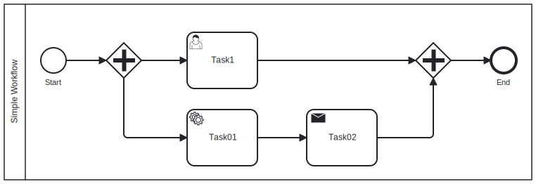

# WorkflowJS

[](https://vhidvz.github.io/workflow-js/)
[](https://htmlpreview.github.io/?https://github.com/vhidvz/workflow-js/blob/master/docs/coverage/lcov-report/index.html)
[](https://github.com/vhidvz/workflow-js/actions/workflows/npm-ci.yml)

WorkflowJS is a lightweight and flexible library for building workflows and processes with NodeJS. It allows you to define processes using BPMN 2.0.

This is a JavaScript library for building and executing workflows. It provides a simple, declarative syntax for defining processes, and offers a flexible and extensible framework for handling workflow events and activities.

## Installation

```sh
npm install workflow-js
```

## Getting Started

### Define a BPMN Schema

To define a BPMN schema, you need to create a file with the extension `.bpmn` and define the schema using the BPMN 2.0 standard or use the online BPMN [editor](https://demo.bpmn.io/new). Here's an example of a simple BPMN schema:



```xml
<?xml version="1.0" encoding="UTF-8"?>
<bpmn:definitions xmlns:xsi="http://www.w3.org/2001/XMLSchema-instance" xmlns:bpmn="http://www.omg.org/spec/BPMN/20100524/MODEL">
  <bpmn:collaboration id="Collaboration_0wlp4ym">
    <bpmn:participant id="Participant_0ae9bpa" name="Simple Workflow" processRef="Process_1igpwhg" />
  </bpmn:collaboration>
  <bpmn:process id="Process_1igpwhg" isExecutable="false">
    <bpmn:startEvent id="StartEvent_1ogvy0x" name="Start">
      <bpmn:outgoing>Flow_0eekk20</bpmn:outgoing>
    </bpmn:startEvent>
    <bpmn:exclusiveGateway id="Gateway_009anth" name="Decision" default="Flow_0hs4ef8">
      <bpmn:incoming>Flow_0eekk20</bpmn:incoming>
      <bpmn:outgoing>Flow_0hs4ef8</bpmn:outgoing>
      <bpmn:outgoing>Flow_05tl31k</bpmn:outgoing>
    </bpmn:exclusiveGateway>
    <bpmn:exclusiveGateway id="Gateway_00y0ktn" name="Aggregation">
      <bpmn:incoming>Flow_1dyucuz</bpmn:incoming>
      <bpmn:incoming>Flow_17n861s</bpmn:incoming>
      <bpmn:outgoing>Flow_1fznvmj</bpmn:outgoing>
    </bpmn:exclusiveGateway>
    <bpmn:endEvent id="Event_16a7ub0" name="End">
      <bpmn:incoming>Flow_1fznvmj</bpmn:incoming>
    </bpmn:endEvent>
    <bpmn:userTask id="Activity_1efomxn" name="Task1">
      <bpmn:incoming>Flow_0hs4ef8</bpmn:incoming>
      <bpmn:outgoing>Flow_17n861s</bpmn:outgoing>
    </bpmn:userTask>
    <bpmn:serviceTask id="Activity_0xzkax6" name="Task01">
      <bpmn:incoming>Flow_05tl31k</bpmn:incoming>
      <bpmn:outgoing>Flow_1720nab</bpmn:outgoing>
    </bpmn:serviceTask>
    <bpmn:sendTask id="Activity_1r8gmbw" name="Task02">
      <bpmn:incoming>Flow_1720nab</bpmn:incoming>
      <bpmn:outgoing>Flow_1dyucuz</bpmn:outgoing>
    </bpmn:sendTask>
    <bpmn:sequenceFlow id="Flow_0eekk20" sourceRef="StartEvent_1ogvy0x" targetRef="Gateway_009anth" />
    <bpmn:sequenceFlow id="Flow_0hs4ef8" sourceRef="Gateway_009anth" targetRef="Activity_1efomxn" />
    <bpmn:sequenceFlow id="Flow_05tl31k" sourceRef="Gateway_009anth" targetRef="Activity_0xzkax6" />
    <bpmn:sequenceFlow id="Flow_1dyucuz" sourceRef="Activity_1r8gmbw" targetRef="Gateway_00y0ktn" />
    <bpmn:sequenceFlow id="Flow_17n861s" sourceRef="Activity_1efomxn" targetRef="Gateway_00y0ktn" />
    <bpmn:sequenceFlow id="Flow_1fznvmj" sourceRef="Gateway_00y0ktn" targetRef="Event_16a7ub0" />
    <bpmn:sequenceFlow id="Flow_1720nab" sourceRef="Activity_0xzkax6" targetRef="Activity_1r8gmbw" />
  </bpmn:process>
</bpmn:definitions>
```

> This simple workflow schema `.bpmn` file located at this [link](./assets/simple-workflow.bpmn).

### Creating a Workflow Instance

To create a new workflow, you need to define a class with methods that represent the different steps of the workflow. You can use decorators to define the nodes and activities of the workflow. Here's an example of a simple workflow:

```ts
import { Process, Node, Value, Data, Activity } from 'workflow-js';

@Process({ name: 'Simple Workflow' })
class SimpleWorkflow {
  @Node({ name: 'Start' })
  start(@Value() value: string, @Activity() activity: any) {
    console.log(value);

    activity.takeOutgoing();
  }

  @Node({ name: 'End' })
  end( @Data() data: { value: string }, @Activity() activity: any) {
    console.log(data);
  }
}
```

### Building and Executing the Workflow

Once you have defined the workflow, you can build and execute it using the WorkflowJS library. Here's how you can do it:

```ts
import { WorkflowBuilder } from 'workflow-js';

const builder = new WorkflowBuilder();

const workflow = builder.build(SimpleWorkflow);

workflow.execute({ value: 'Hello World!' });
```

## [More Examples](./example/)

## License

This project is licensed under the MIT License - see the [LICENSE](LICENSE) file for details
